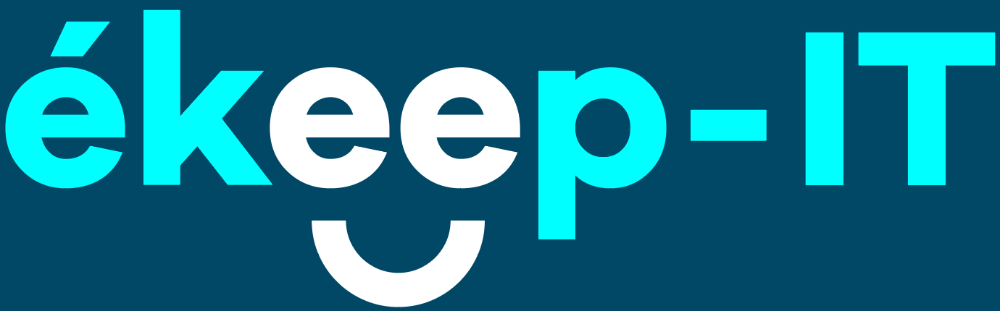

> 🚧 **Ce projet est en perpétuelle mise à jour** 🚧 .D'éventuels changements de restructuration de dossier peuvent changer. En ce qui concerne la connaissance de ces guidelines, je vous invite à y jeter un œil régulièrement pour voir si des nouveautés s'y trouvent.

# Guidelines

Ce projet met en avant les différentes Guidelines au sein de notre incubateur.

Pour information, ce site utilise [Docusaurus 2](https://docusaurus.io/).

## Vous voulez contribuer ?

Nous ne sommes pas fermés aux améliorations sur cette documentation. Si vous souhaitez participer à la rédaction et la mise en place de règle de bonnes pratiques dans un but d'amélioration continue des livrables, c'est tout fait possible ! Cependant, il y a quand même quelques règles à respecter, expliquer ci-dessous :

Pour cela, il vous faudra :

1. Cloner le projet

```
git clone https://github.com/Ekeep-IT/guidelines.git
```

2. Créer une nouvelle branche en fonction de ce que vous souhaitez réaliser. Si vous avez des questions sur la création de branche et aux bonnes pratiques sur ce sujet, je vous invites à lire cet [article]([http://test](https://ekeep-it.github.io/guidelines/docs/git/naming-branch-convention)) sur le sujet.

3. Créer une pull request

:exclamation: **Cette dernière doit contenir** :

- **Une titre :** bref résumé informatif du sujet traité
- **Une description :** texte explicatif plus détaillé décrivant la PR pour les reviewers.

  - Sujet :
    - Résumé court et descriptif
    - Commencez par l'identifiant de ticket _(s'il y en a un)_, correspondant (par exemple, de Jira, problème GitHub, etc.)
    - Doit être en majuscule et écrit au présent de l'impératif
    - Ne pas se terminer par une période

Exemple de format`:

```
# [Ticket_ID] PR description
```

Exemple de concret :

```
# JIRA-21 Ajout des guidelines ReactJS pour le front
```

- Description :
  - Séparé par une ligne vide du sujet
  - Expliquez quoi, pourquoi, etc.
  - Chaque début de paragraphe en majuscule

Exemple de concret :

```
Cette pull request correspond à la mise en place d'une partie des guidelines ResactJS pour l'incubateur.

Vous pouvez retrouver:
- La gestion des états
- Convention de nommage
```

## lancer le projet en local

```
npm run start
```

Cette commande démarre un serveur de développement local et ouvre une fenêtre de navigateur. La plupart des modifications sont reflétées en direct sans avoir à redémarrer le serveur.

## Déploiement en production

La mise en production est effectuée via la génération d'une build orchestré via GitHub Action.
